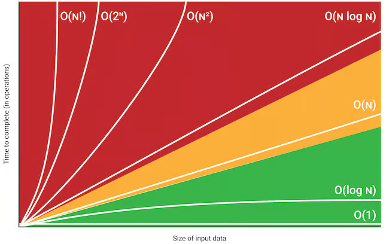

Resumo do capitulo:

Precisamos entender sobre o desempenho de um algoritmo e com isso temos o que chamamos de Big O Notation.

A notação Big O é uma maneira de descrever o desempenho ou a eficiência de um algoritmo em termos de quanto tempo ou espaço ele requer à medida que o tamanho da entrada aumenta.


PARA COMEÇAR O REQUISITO EM MATEMÁTICA É ÁLGEBRA BÁSICA.

No caso precisamos entender por exemplo a função f(x) = x * 2.

Supondo então que X seja igual a 5.
Qual seria o valor de f(5)? 

No caso seria 10. Pois substituindo x por 5 teríamos:

```math
5 * 2 = 10
```

Outro exemplo:


```math
f(3)=3×2=6
```
Então, quando x = 3, f(x) é igual a 6.

Voltando agora para entendermos a notação Big O que mede a eficiencia de uma função.

De maneira geral a notação Big O é escrita da seguinte forma:


```math
Big O ==> O(n) <== Número de operações
```

O que a busca binária tem em relação com a notação Big O?
Uma busca simples percorre um array item por item para encontrar um item.

Já uma busca binária busca a partir do meio, verifica se o numero é maior ou menor e a partir disso busca apartir da outra metade e assim em diante. (Vide exercicios).

No exemplo de uma lista de 100 numeros, para encontrarmos o numero 100 por exemplo teríamos que percorrer 100 vezes. Já na busca binária seria 7 vezes.

```javascript
//Exemplo com 10 numeros:

//Busca simples percorreria um por um: 
[10, 9, 8, 7, 6, 5, 4, 3, 2, 1]
//Busca binária a cada iteração corta a quantidade de possibilidades pela metade:
[10, 5, 3, 2, 1]
```
Ou seja de maneira geral uma lista de n números, a pesquisa simples levaria n etapas enquanto a pesquisa binária precisa de log 2 n para retornar o valor correto.

Entendendo logaritmos:

Um logaritmo é uma função matemática que nos diz o expoente ao qual uma base específica deve ser elevada para produzir um determinado número.

Por exemplo, considere a expressão 
log 𝑏 (𝑥) = 𝑦, onde:

𝑏 é a base do logaritmo,
𝑥 é o valor que queremos encontrar o logaritmo, 
𝑦 é o resultado, ou seja, o expoente ao qual a base 𝑏 deve ser elevada para obter 𝑥

Vamos dar um exemplo prático:

Logaritmo na base 2:

```math
log 2 (8) = 3
 ```
Isso significa que 2 elevado a qual potência (ou seja, y) resulta em 8?

A resposta é 3, porque 2 elevado a 3 = 8.

Portanto log 2 (8) = 3

Mais um exemplo:
Basicamente a expressão log 10 100 nos diz: "Quantos 10s conseguimos multiplicar para chegar a 100?"

A resposta é 2: 10x10. Então log de 100 na base 10 = 2.

Logaritimos são opostos de exponenciais. 
Ex:

2 elevado a 3 = 8 <===> log 2 (8) = 3

2 elevado a 4 = 16 <===> log 2 (16) = 4

2 elevado a 5 = 32 <===> log 2 (32) = 5

Exemplos comuns de tempo de execução Big O:

O(log n), também conhecido como tempo logarítmico. Ex: pesquisa binária
O(n), conhecido como tempo linear. Ex: Pesquisa simples.
O(n * log n) Ex: algoritmo rapido de ordenação como o quicksort.
O(n²) Ex: algoritmo lento de ordenação como a ordenação por seleção.
O(n!) Ex: algoritmo bastante lento como o do caixeiro viajante.

